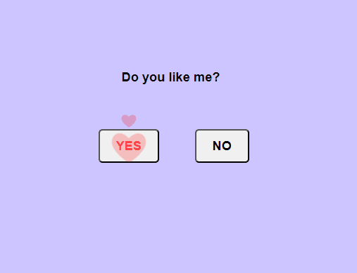

# 💘 Do You Like Me?

A fun and cheeky little website that asks the eternal question:
**"Do you like me?"** 😏

## 🎯 Features

* Two buttons: **Yes** and **No**
* If you click **Yes** – the site happily accepts your love 😍
* If you try to click **No** – good luck... the button just won’t cooperate! 😈

## 📸 Preview

## 🚀 Live Demo

[Click here to try it out!](https://semant.is-a.dev/do-you-like-me)

## 🛠️ Tech Stack

* HTML
* CSS
* JavaScript

## 🤝 Contributing

Pull requests are welcome! Feel free to suggest fun new features or improvements.

## 📄 License

MIT License
